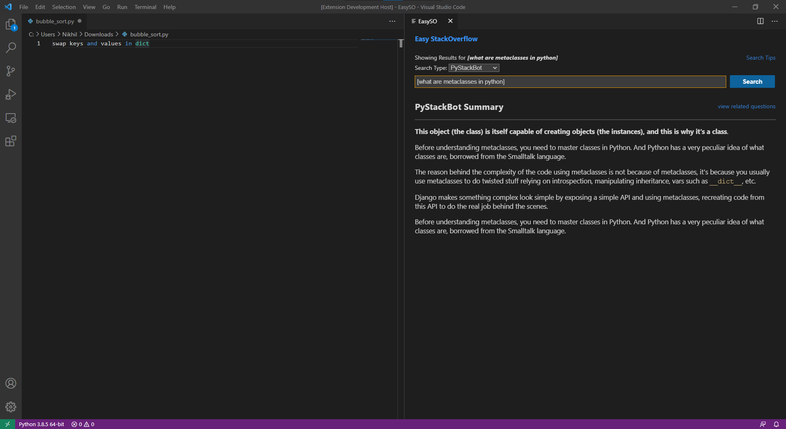

# Easy StackOverflow

# About
Easy StackOverflow is a vscode extension to search and get query searched on stack overflow easily in vscode, including error search, direct answer search, related questions serach, tag search and more. Get summarized answers to python technical questions powered by PyStackBot. 

# Table of contents

- [Installation](#installation)
- [Command Line Usage](#usage)
- [API Documentation](#api)
- [Contributing](#contributing)
- [About Contributors](#contributors)


# Installation

For Normal Users
> 1. Download 'easyso-1.0.0.vsix' in releases and open this file in vscode using cmd: ```code easyso-1.0.0.vsix``` or use extension tab in vscode and click 'install from VSIX' and select this file.
<br/>OR
> 2. Install from vscode marketplace [EasySO](https://marketplace.visualstudio.com/items?itemName=officiallynik.easyso)

For Developers
> 1. Download this repository.
> 2. Navigate into the directory.
> 3. Install required npm packages using cmd: ```npm install``` (requires node and npm)
> 4. Navigate into 'app' folder inside EasySO directory.
> 5. Install required npm packages for svelte app using cmd: ```npm install``` (requires node and npm)
> 6. Build svelte app using cmd: ```npm run build```
> 7. Open vscode with EasySO as working directory.
> 8. Press F5 or extension tab to debug and run the extension.
> > Feel free to modify extension, add more features and hit us with a pull request. More Info [Here](#contributing) 

# Usage

[(Back to top)](#table-of-contents)

## Query Search
Search for a query and get top answers for python directly using PyStackBot.
Not satisfied with PyStackBot answers, use direct Stack Overflow search.
Stack Overflow search works for any type of query, not only python queries.
<br/><b>Key Binding: opt/alt + cmd/ctrl + s</b>
<br/>StackOverflow Search

PyStackBot Search (Python Only)

StackOverflow View


## Tag Search
Search for a specific word or technology you want to know about.
Get to know the brief explanation/details about that tag/technology.
Tag search works when you search for a tag enclosed between [], eg: [django].
<br/><b>Key Binding: opt/alt + cmd/ctrl + s</b>


## Error Search [Python Only]
Search for error from terminal after executing the file.
Get to the brief definition of error and questions related to that error.
Error search works afer executing [only python files] files, and you get an error.
<br/><b>Key Binding: opt/lt + cmd/ctrl + e</b>

More About Error


## Auto Query Search [Python Only, Beta]
Search for query about currently working python file without you needing to explain the query.
Auto Query generates and searches for query automatically.
Auto Query works on only python files, and accuracy might be low.
<br/><b>Key Binding: opt/alt + cmd/ctrl + a</b>


## Summarised Answers for Technical Questions [Python Only, Beta]
Search for technical question and get a summarised answer without needing to scavenge for answers.
Technical Answer Summariser works for only python related question, and accuracy might be low.
To search type your question enclosed in [], eg: [what are metaclasses in python].
<br/><b>Key Binding: opt/alt + cmd/ctrl + s</b>


# API
[(Back to top)](#table-of-contents)
### Architecture
   
### 

## Svelte App
Svelte is used to make web views, made beautifull web view using svelte which looks native to stack overflow. Finally svelte bundles app into js and css files which is included in app_page.ts file. Axios requests to stack exchange api and to local pystackbot is also handled in this app.  

## Extension
Used yo code generator and webpack to create extension. Used vscode api like web view creation and listening on commands to write three fundamental functions which handle the main extension functionalities. The app_page file includes the css and js file bundled by svelte app to create a native experience stack overflow extension which aids in faster development specially to python developers. 

## Auto Query Generator
Used idf.csv file generated during PyStackBot training to generate auto query using the IDF metrics on selected code of the python file. This feature is still in beta and needs lot of improvements and metrics to improve accuracy of query generated. As mentioned earlier modification and pull requests are highly encouraged.

___
NOTE: Each file and contains inside the file (like functions, classes) are well documented using comments. Developers and easily understand the flow and code using those comments.
___

# Contributing

[(Back to top)](#table-of-contents)

Your contributions are always welcome! Recommended steps to contriburte
1. Fork the repo
2. Read comments of files you want to change to understand what exactly it does
3. Make changes in your environment
4. Test the changes locally.
5. Upload to your github and issue a pull request.
6. Pull request must contain the file changes, why they are made and what are the improvements or new features.

# Contributors

[(Back to top)](#table-of-contents)

[Nikhil M](https://github.com/officiallynik)

[Sameed Ali](https://github.com/mir-sam-ali)

Mentor: Eashaan Rao

Guide: Sridhar Chimalakonda
