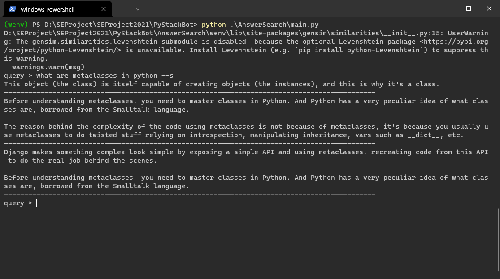
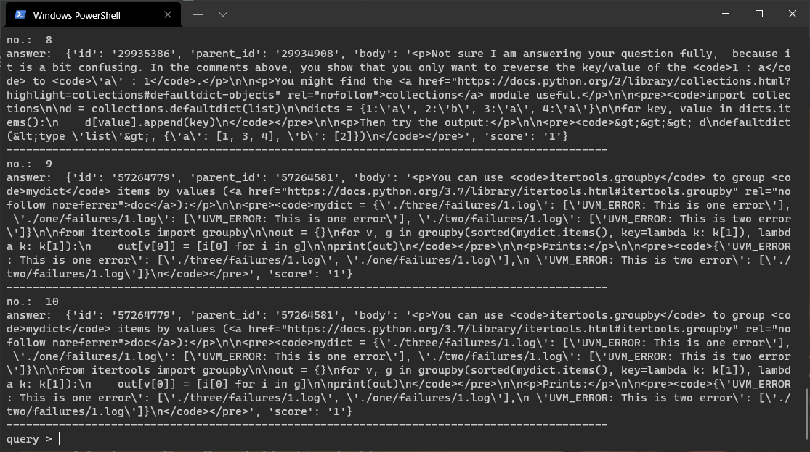
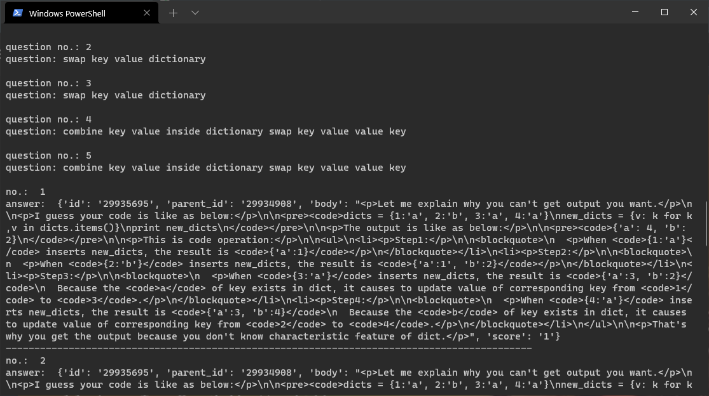
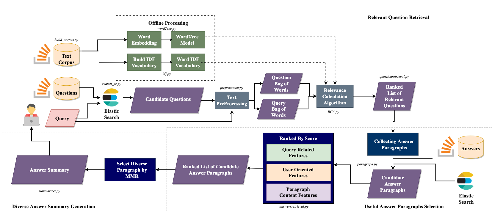

# PyStackBot

[](http://forthebadge.com)


PyStackBot is a StackOverFlow answer summarizer for automated/manually generated queries in vscode for python developers. 


# Table of contents

- [Installation](#installation)
- [Command Line Usage](#usage)
- [API Documentation](#api)
- [About Contributors](#contributors)
- [Contributing](#contributing)


# Installation

1. First install elasticsearch on your system

> - windows recommended installation guide:
[elastic search windows](https://www.elastic.co/guide/en/elasticsearch/reference/current/windows.html#install-msi-gui)
> - macOS using homebrew: ```brew install elasticsearch```
> - linux using respective package managers, eg: ubuntu: ```apt-get install elasticsearch```

2. Configure elasticsearch to run locally on port 9200 [only on macOS and linux]

> - add 'network.host = localhost' to elasticsaerch.yml file
```
# ---------------------------------- Network -----------------------------------
#
# Set the bind address to a specific IP (IPv4 or IPv6):
#
network.host: localhost
```

3. Starting elasticsearch server
> - on windows: execute elasticsearch.exe in {installation_folder}/bin
> - on macOS or linux: sudo service elasticsearch start  

Note: go to 'localhost:9200' on your browser, if you get a response then elasticsearch is running locally. Otherwise get help in starting elasticsearch server online.

4. Download all the files given in [this drive link](https://drive.google.com/drive/u/0/folders/1WmS67_kypdYC6gCuK2MYif1a-gJX3TDE). 
   Place the files in the given directories.
   ```bash
   questions_data.csv                    -> Backend/AnswerSearch/Data (Create a new directory in AnswerSearch Directory)
   answers_data_new.csv                  -> Backend/AnswerSearch/Data
   corpus.txt                            -> Backend/AnswerSearch/Word2Vec
   word2vec.model                        -> Backend/AnswerSearch/Word2Vec
   word2vec.model.trainables.syn1neg.npy -> Backend/AnswerSearch/Word2Vec
   word2vec.model.wv.vectors.npy         -> Backend/AnswerSearch/Word2Vec
   idf.csv                               -> Backend/AnswerSearch/IDF
   ```

5. Create virtual env (recommended) and run the below command to install the required packages.
  ```bash
    pip3 install -R ./AnswerSearch/requirements.txt
  ```

6. Run the commands `cd AnswerSearch/es_search` and then `python3 insert_data.py` to insert data into elastic search server.

7. Start using `PyStackBot` (navigate to root folder of pystackbot)
```bash
  python3 index.py
```  

# Usage

[(Back to top)](#table-of-contents)

Go to AnswerSearch Directory. Then run the below command
 ```bash
    python3 main.py
 ```
A command line interface for using our tool is shown.
Follow below given rules for searching your query in the given CLI.

- To view the answer summary of the your query, just enter your query on the CLI and pass --s flag to summarize.
   
- To view only answers without summarizing omit --s flag
   
- Use --q flag to also view the relevant questions that were chosen.
   

# API
[(Back to top)](#table-of-contents)
### Architecture
   
### Folder Structure
```
PyStackBot
├── AnswerSearch
│   ├── AnswersRetrieval
│   |   └── RCA.py
│   |   └── answerretrieval.py
|   |   └── paragraph.py
│   ├── DataQuery
│   |   └── README.md
│   |   └── query_data.ipynb
│   ├── IDF
│   |   └── idf.py
│   ├── QuestionsRetrieval
│   |   └── RCA.py
│   |   └── questionretrieval.py
│   ├── Summarizer
│   |   └── summarizer.py
│   ├── Word2Vec
│   |   └── build_corpus.py
│   |   └── word2vec.py
│   ├── es_search
│   |   └── insert_data.py
│   |   └── question_es.py
│   ├── preprocessor
│   |   └── emoticons.py
│   |   └── preprocessor.py
|   |   └── remove_stopwords.py
|   |   └── software_tokenizer.py
|   └── README.md
|   └── requirements.txt
|   └── main.py
└── index.py
└── README.md
└── .gitignore
```
## General
Created a flask application which uses AnswerSearch to serve answers using 2 API endpoints on port 5000 locally. One API serves best 5 answers to any python question. The second API is used to get summazised answer to a technical python question.

## DataQuery
Used google big query API to build questions and answers dataset of about 300k python questions. How to use the query_data jupyter notebook is given in readme file inside DataQuery directory.  

## Preprocessor
Text preprocessor is used to processor dataset. The emoticons file is used to handle emoticons in title, body of questions and answers. Similarly stopwords are handled using remove_stopwords file. Handled complex data such as email, code, etc using software_tokenizer. Finally using all above discussed files, NLTK, and some custom functions, text of body, title are processed to form which can be used.  

## IDF
Using the text processor on questions dataset and TF_IDF model of sklearn library we build a idf metrics of python dataset, then dump this metrics into a reusable csv file. 

## Word2Vec
Using gensim library's word2vec model on questions dataset to prepare a word2vec model. Save this model in the same directory. 

## Es_search
Elastic search is the first level of retrieving the most relevant questions to the asked query. Run elastic search locally and dump both answers and questions data into elastic search. Elastic search can then be used to retrived 100 most relevant questions easily.

## QuestionsRetrieval
Contains the main logic for retrieving most relevant questions. First use elastic search to get 100 most relevant questions. Then used word2vec model (built in word2vec folder) to score words in questions on relevance to asked query words and used idf metrics to identify most important words. Finally ranks the questions based on generated score and returns the top 5 questions.

## AnswersRetrieval
Gets all the answers to above generated top 5 questions. As discussed earlier, used idf metrics and word2vec model again to rank all the retrieved answers. Used elastic search we get answers to those top 5 questions using question id. Finally ranks the answers based on generated score and returns the top 5 answers.

## Summarizer
Summarizer is an extension to AnswersRetrieval discussed above. All the answers are further divided into paragraphs intelligently (see file paragraph.py in AnswersRetrieval), then use MMR technique to score the paragraphs. Return the top paragraphs which is the summarized answer to technical python questions.

___
NOTE: Each file and contains inside the file (like functions, classes) are well documented using comments. Developers and easily understand the flow and code using those comments.
___

# Contributing

[(Back to top)](#table-of-contents)

Your contributions are always welcome! Recommended steps to contriburte
1. Fork the repo
2. Read comments of files you want to change to understand what exactly it does
3. Make changes in your environment
4. Test the changes locally.
5. Upload to your github and issue a pull request.
6. Pull request must contain the file changes, why they are made and what are the improvements or new features.

# Contributors

[(Back to top)](#table-of-contents)
<br/>
[Nikhil M](https://github.com/officiallynik)
<br/>
[Sameed Ali](https://github.com/mir-sam-ali)
</br>
Mentor: Eashaan Rao
</br>
Guide: Sridhar Chimalakonda
